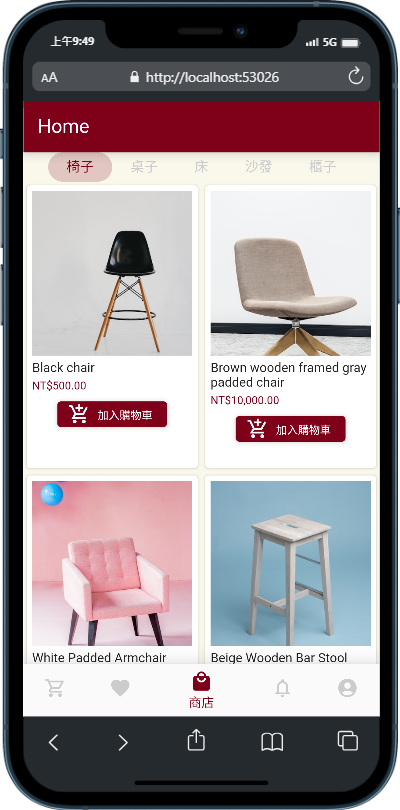
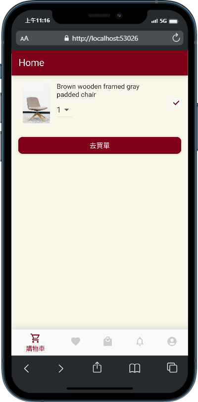
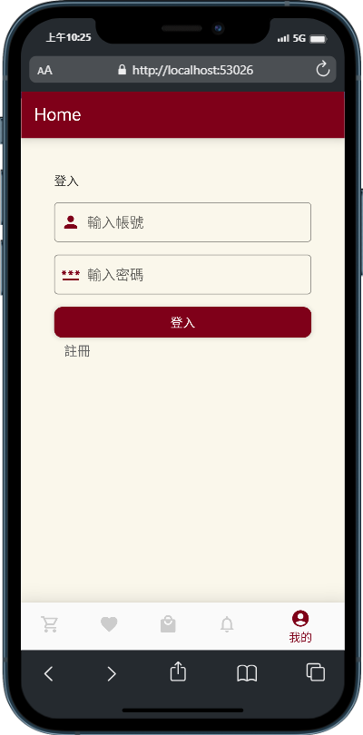
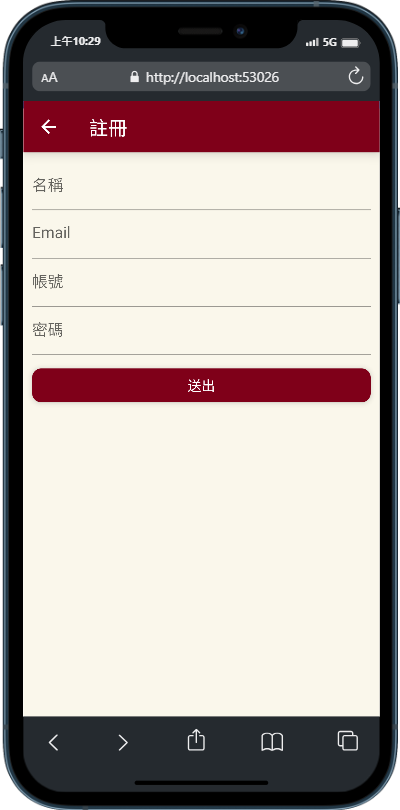
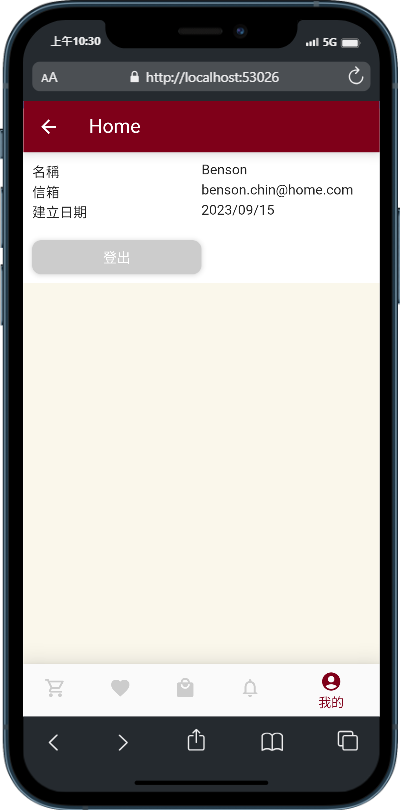

## Home 家具電商 app - FLutter & Node.js & MongoDB

### Screenshots

|             Product Page             |              Cart Page               |
| :----------------------------------: | :----------------------------------: |
|  |  |

|              Login Page              |            Register Page             |              User Page               |
| :----------------------------------: | :----------------------------------: | :----------------------------------: |
|  |  |  |

### Project Structure

#### Root

- `README.md`: This project documentation.
- `home/`: Flutter App frontend code.
- `home_api/`: Node.js API backend code.

#### `home/lib` Frontend Code

- `models/`: data class model.
- `providers/`: login, register api request.
- `screens/`: App screens.
- `services`: app theme, language localization, api route, shared preference setting.
- `widgets/`: App widgets.
- `main.dart`: Entry point of the Flutter app.

#### home_api/ Backend Code

- `db/conn.mjs`: MongoDB connection setting.
- `routes/`: API calling routes setting.
- `index.mjs`: Main entry point for the API.

### LICENCE

[WTFPL](http://www.wtfpl.net/about/)
